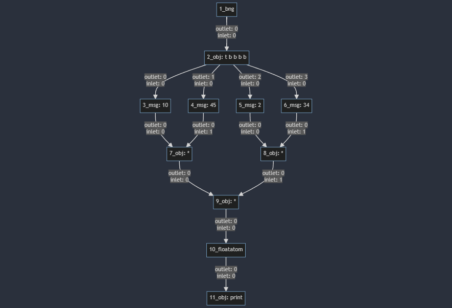

# alternate patchfile representations

In Pd, the records in the text patchfiles are stored in the order of creation of objects, connections and not in a topologically sorted manner.
This non-sequential nature of the textual representation could make it harder for the model to learn patterns effectively.

we could maybe try sorting the records based on their spatial coordinates to create a more consistent and potentially learnable structure.

The algorithm in `\final-sort-algo.py` does the following:
- Parses the patch text into individual records.
- Separates object records from connection records.
- Sorts object records based on their x and y coordinates.
- Updates connection records to reflect the new positions of objects.
- Reconstructs the sorted patch text.

example patchfile before reordering of records:
```
#N canvas 962 288 452 302 10;
#X obj 150 230 print;
#X obj 150 160 +;
#X obj 150 70 t b b;
#X msg 150 110 1;
#X msg 180 110 2;
#X obj 150 50 bng 15 250 50 0 empty empty empty 17 7 0 10 #fcfcfc #000000
#000000;
#X floatatom 150 190 5 0 0 0 - - -, f 5;
#X connect 1 0 6 0;
#X connect 2 0 3 0;
#X connect 2 1 4 0;
#X connect 3 0 1 0;
#X connect 4 0 1 1;
#X connect 5 0 2 0;
#X connect 6 0 0 0;
```
after reordering of records:
```
#N canvas 510 289 454 305 10;
#X obj 140 47 bng 15 250 50 0 empty empty empty 17 7 0 10 #fcfcfc #000000
#000000;
#X obj 140 70 t b b;
#X msg 140 120 1;
#X msg 170 120 2;
#X obj 140 170 +;
#X floatatom 140 200 5 0 0 0 - - -, f 5;
#X obj 140 240 print;
#X connect 0 0 1 0;
#X connect 1 0 2 0;
#X connect 1 1 3 0;
#X connect 2 0 4 0;
#X connect 3 0 4 1;
#X connect 4 0 5 0;
#X connect 5 0 6 0;
```

This sorted representation should provide a more consistent structure for the language model to learn from. Objects will appear in a predictable order based on their visual layout in the patch, which could help the model better understand the relationships between objects.

## other ways to represent patchfiles visually:
### mermaid diagrams:

#### example patch file:
```
#N canvas 834 168 528 406 10;
#X text 130 60 multiply 10 \, 45 \, 2 and 34;
#X obj 180 90 bng 15 250 50 0 empty empty empty 17 7 0 10 #fcfcfc #000000 #000000;
#X obj 180 120 t b b b b;
#X msg 120 170 10;
#X msg 180 170 45;
#X msg 230 170 2;
#X msg 290 170 34;
#X obj 170 210 *;
#X obj 250 210 *;
#X obj 200 260 *;
#X floatatom 200 310 5 0 0 0 - - -, f 5;
#X obj 200 350 print;
#X connect 1 0 2 0;
#X connect 2 0 3 0;
#X connect 2 1 4 0;
#X connect 2 2 5 0;
#X connect 2 3 6 0;
#X connect 3 0 7 0;
#X connect 4 0 7 1;
#X connect 5 0 8 0;
#X connect 6 0 8 1;
#X connect 7 0 9 0;
#X connect 8 0 9 1;
#X connect 9 0 10 0;
#X connect 10 0 11 0;
```

#### mermaid representation
```
flowchart TD
    A[1_bng]
    B[2_obj: t b b b b]
    A -->|outlet: 0 \n inlet: 0| B
    C[3_msg: 10]
    B -->|outlet: 0 \n inlet: 0| C
    D[4_msg: 45]
    B -->|outlet: 1 \n inlet: 0| D
    E[5_msg: 2]
    B -->|outlet: 2 \n inlet: 0| E
    F[6_msg: 34]
    B -->|outlet: 3 \n inlet: 0| F
    G[7_obj: *]
    C -->|outlet: 0 \n inlet: 0| G
    D -->|outlet: 0 \n inlet: 1| G
    H[8_obj: *]
    E -->|outlet: 0 \n inlet: 0| H
    F -->|outlet: 0 \n inlet: 1| H
    I[9_obj: *]
    G -->|outlet: 0 \n inlet: 0| I
    H -->|outlet: 0 \n inlet: 1| I
    J[10_floatatom]
    I -->|outlet: 0 \n inlet: 0| J
    K[11_obj: print]
    J -->|outlet: 0 \n inlet: 0| K
```
